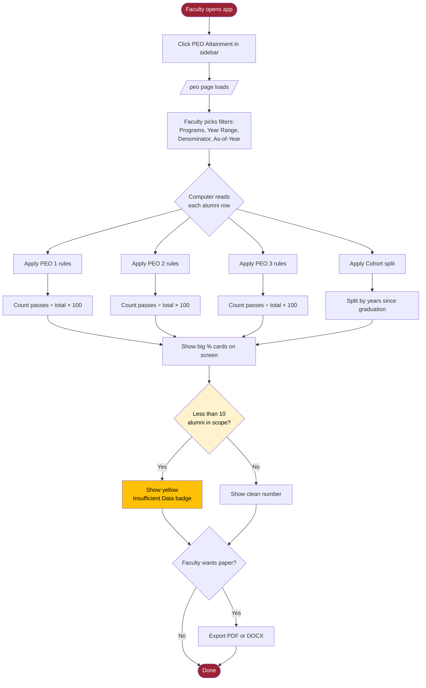
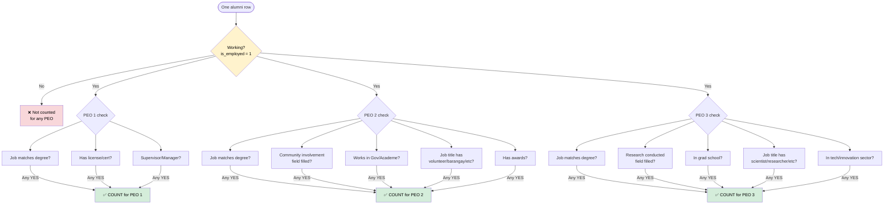
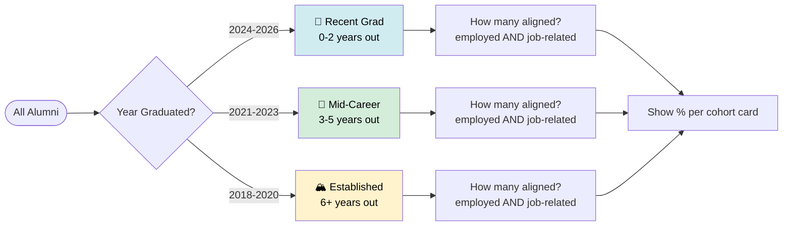
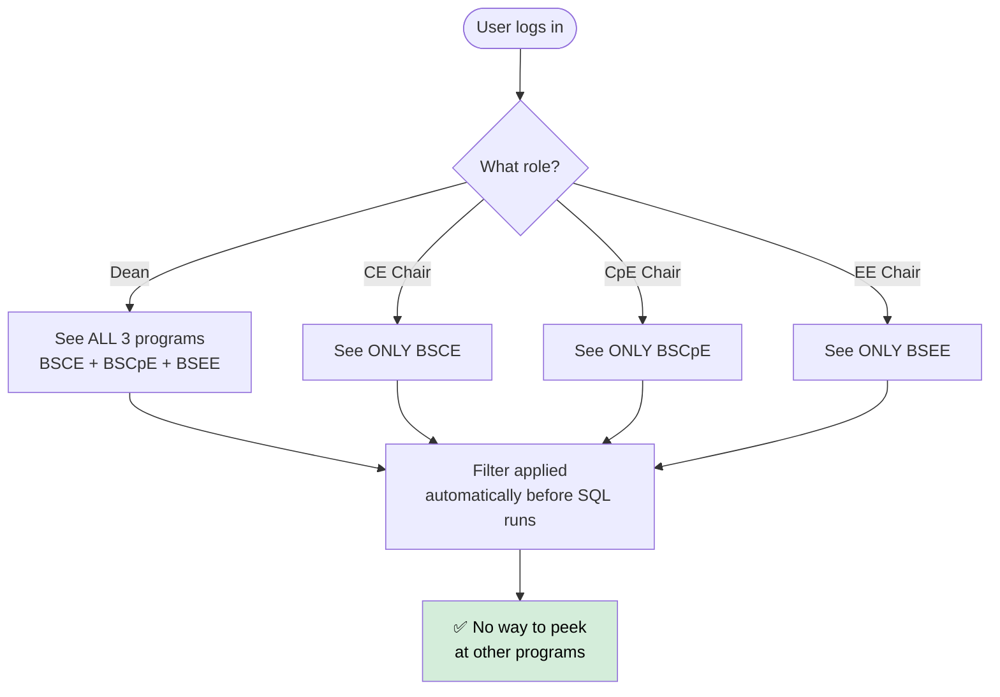
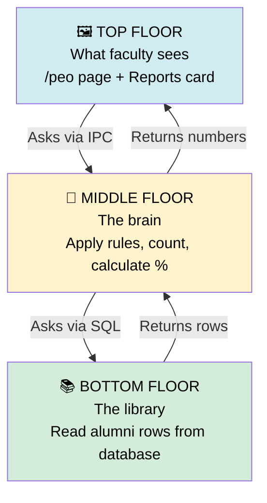
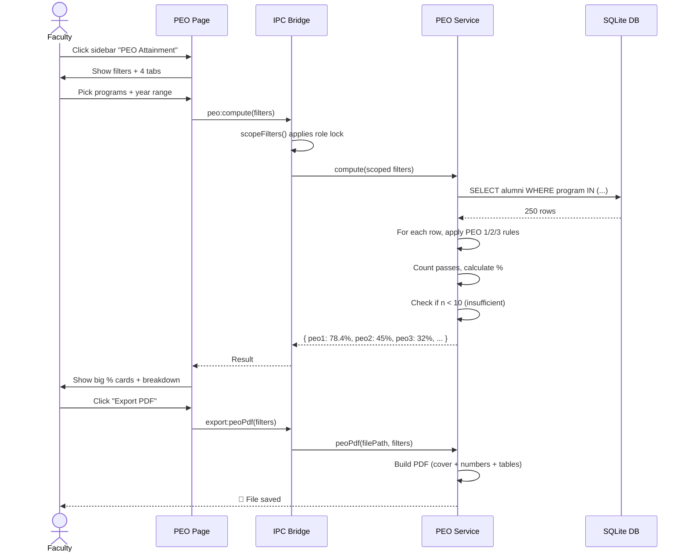

# PEO Module — Caveman Edition Explainer 🦴

> **Audience:** Non-IT faculty (Dean, Chairpersons), accreditation reviewers
> **Purpose:** Explain how the PEO Attainment module works in plain language
> **Companion to:** [PEO-IMPLEMENTATION-PLAN.md](PEO-IMPLEMENTATION-PLAN.md) (technical spec)

---

## What This Thing Does

School make 3 promises about graduate. Now we count: **how many alumni really became this?** Big number on screen = proof for accreditation people.

---

## The Three Promises

| PEO | Short Name | The Promise |
|-----|------------|-------------|
| 🏆 **PEO 1** | Professional Competence | Graduate good at job — skilled, licensed, climbing ladder |
| 🤝 **PEO 2** | Ethics & Social Responsibility | Graduate good person — helps community, ethical, recognized |
| 🔬 **PEO 3** | Innovation & Sustainability | Graduate makes new things — research, tech, sustainability |

---

## How It Works — Big Picture Flowchart



---

## How Each PEO Gets Counted (Decision Logic)



> **Caveman rule:** Working = MUST. Then any ONE box ticked under that PEO = COUNT.

---

## Step-by-Step Walkthrough

### Step 1 — Faculty Open App

Faculty click sidebar → **"PEO Attainment"** 🏆

Page open. Show 4 tabs at top:

```
[ PEO 1 ] [ PEO 2 ] [ PEO 3 ] [ Outcome Rates ]
```

---

### Step 2 — Faculty Pick Filters

Top of page got buttons:

- **Programs** → pick CE, CpE, EE, or all
- **Year range** → pick 2018 to 2025 (or whatever)
- **Denominator** → "all alumni" or "only employed"
- **As-of-Year** → default = today's year (2026)

> 🔒 *Dean see all programs. CE Chair only see CE — robot enforce this automatically.*

---

### Step 3 — Computer Goes to Database

For **each alumni row**, computer ask 4 questions per PEO. See decision flowchart above ⬆️

---

### Step 4 — Computer Does Math

```
PEO 1 % = (alumni who passed PEO 1) ÷ (total alumni) × 100
PEO 2 % = (alumni who passed PEO 2) ÷ (total alumni) × 100
PEO 3 % = (alumni who passed PEO 3) ÷ (total alumni) × 100
```

**Example:** 250 alumni total. 196 passed PEO 1.
→ **PEO 1 = 78.4%** ✓

---

### Step 5 — Show Big Number on Screen

Faculty see:

```
┌─────────────────────────┐  ┌──────────────────────────┐
│  PEO 1                  │  │  Why they passed:        │
│                         │  │                          │
│  78.4%                  │  │  ✓ Job-related: 180/250  │
│                         │  │  ✓ Has license:  95/250  │
│  196 of 250 alumni      │  │  ✓ Supervisory:  60/250  │
└─────────────────────────┘  └──────────────────────────┘
```

Left card = the big % number.
Right card = **show the work**, like math homework. Accreditor can see exactly which boxes ticked.

---

### Step 6 — Outcome Rates Tab (Cohort Split)

Splits alumni by **how long since graduation:**



| Cohort | Graduated | Why care |
|--------|-----------|----------|
| 🌱 Recent (0–2 yrs) | 2024–2026 | Fresh grads — still finding feet |
| 🌳 Mid-Career (3–5 yrs) | 2021–2023 | Sweet spot for accreditation |
| 🏔️ Established (6+ yrs) | 2018–2020 | Old grads — should score highest |

If old grads score LOW → red flag for school. School not preparing them well.

---

### Step 7 — Faculty Want Paper Report

Faculty click **"Export PDF"** or go to **Reports page** → "PEO Attainment Report" card.


---

## Safety Nets

### 🟡 "Tiny Number" Warning

If only **8 alumni** match the filter, computer NOT just say "100%!" Computer add **yellow badge:**

> ⚠️ Insufficient data (n=8)

Why? Because "100% from 2 alumni" embarrass school. Honesty better.

### 🔒 Permission Locks



### 📅 Date Auto-Updates

Cohort math uses today's year automatically. Next year, "Recent Grad" shifts from 2024-2026 → 2025-2027 by itself. No manual edit needed.

---

## How Computer Builds This (3-Floor Architecture)



Each floor talks ONLY to floor below. Clean. Safe. Easy to fix later.

---

## Where Data Comes From (Already in Database!)

| What we check | Database column |
|---------------|-----------------|
| Working? | `is_employed` |
| Job match? | `job_relevance` |
| License? | `has_license` + `other_certifications` |
| Boss role? | `job_level` |
| Community work? | `community_involvement` ⭐ *(direct field exists!)* |
| Research? | `research_conducted` ⭐ *(direct field exists!)* |
| Awards? | `has_awards` |
| Industry? | `industry_sector` |
| When grad? | `year_graduated` |

> **Big win:** Database ALREADY has community + research fields. Don't need to ask alumni again. Just use what we got.

---

## What Computer DOES NOT Do

- ❌ Not change any existing data
- ❌ Not break dashboard or other pages
- ❌ Not need internet (works offline)
- ❌ Not show wrong numbers — has tiny-data warning
- ❌ Not let CE Chair peek at EE numbers — locked by role

---

## End-to-End Journey (One Picture)



---

## TL;DR for Non-IT Faculty

> **PEO module = scoreboard.**
> Plug in filters → see big % number → see why → print it for accreditation.
> Safe, locked by role, honest about small samples, auto-updates each year.

---

## Quick Reference Card (Print This!)

| Question | Answer |
|----------|--------|
| Where do I find it? | Sidebar → TOOLS → "PEO Attainment" |
| What can I filter by? | Programs, year range, denominator (all/employed), as-of-year |
| Why does it say "Insufficient data"? | Less than 10 alumni in your filter — too few to trust the % |
| Why can't I see other programs? | Your role only allows your program (CE/CpE/EE Chair) |
| How do I export for accreditation? | Click "Export PDF/DOCX" on /peo page OR go to Reports → "PEO Attainment Report" card |
| Does it update automatically each year? | Yes — cohort years roll forward each January |
| What if alumni didn't fill the community/research field? | Computer falls back to checking job sector + job title keywords |
| Will it slow down the app? | No — same speed as the dashboard |

---

End of explainer. For technical details see [PEO-IMPLEMENTATION-PLAN.md](PEO-IMPLEMENTATION-PLAN.md).
