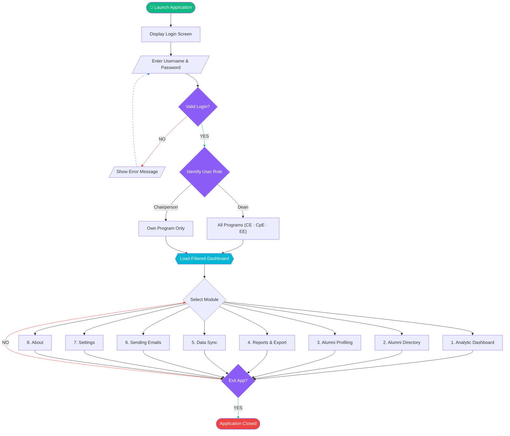
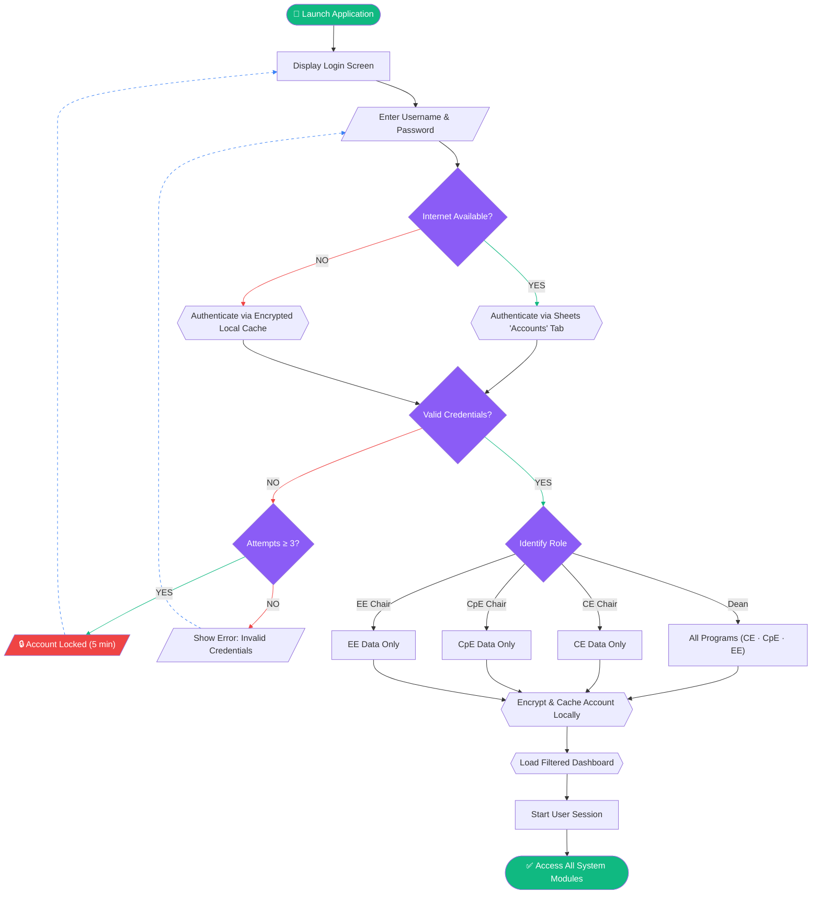
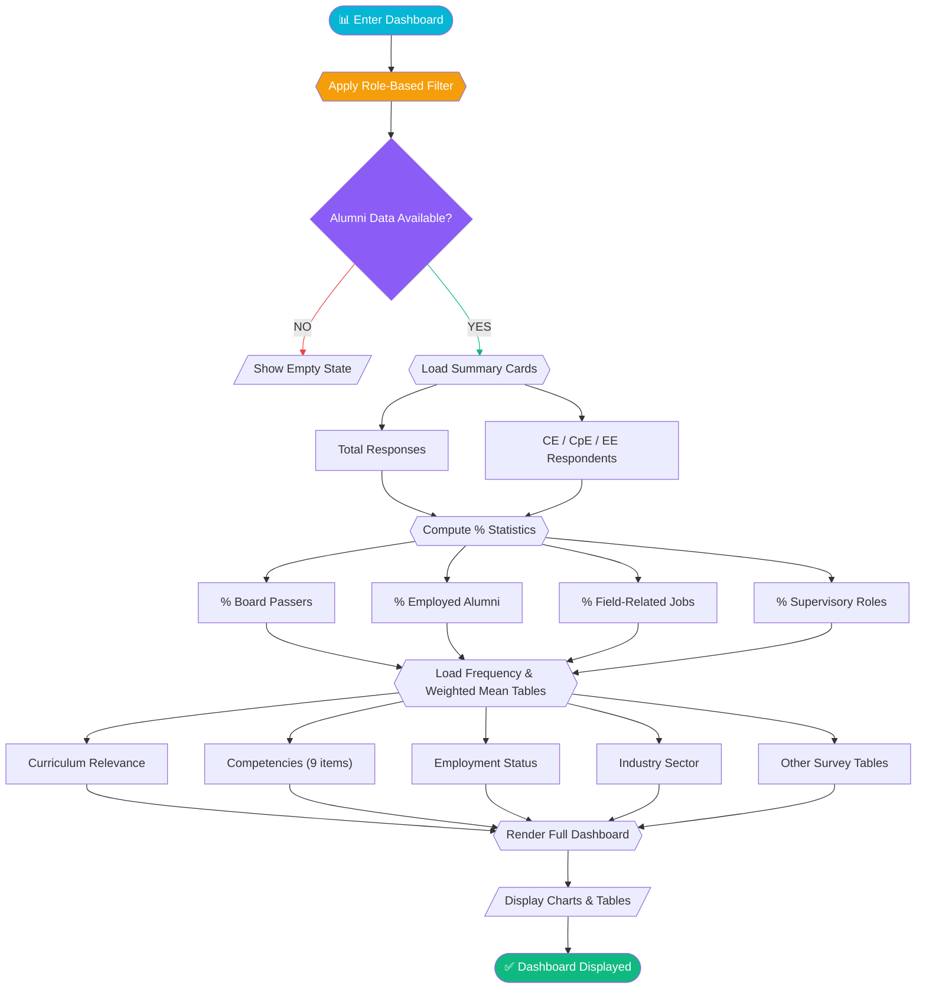
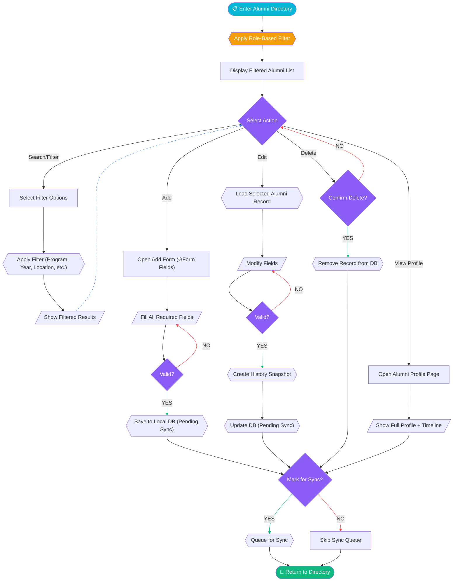
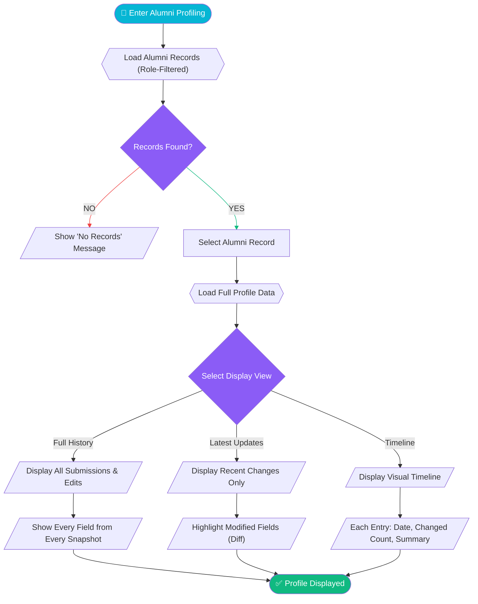
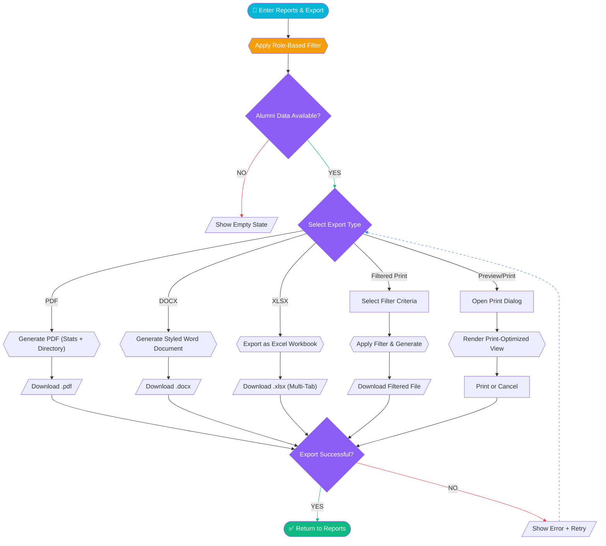
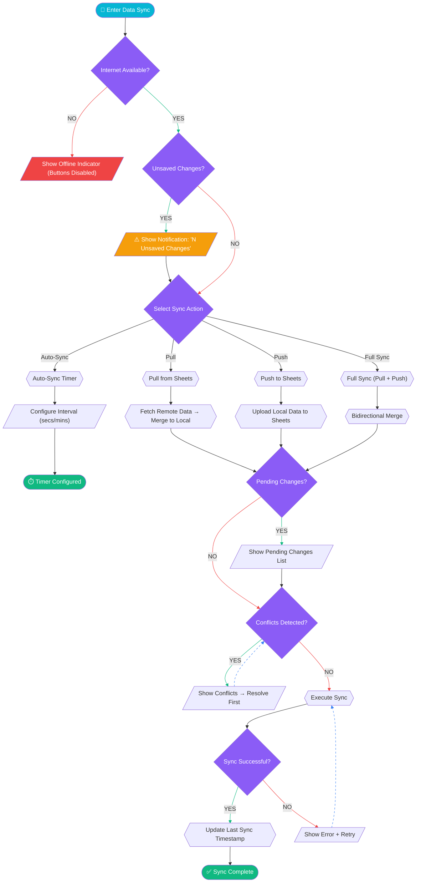
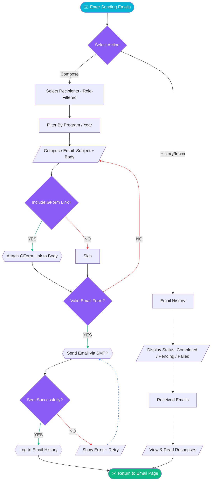
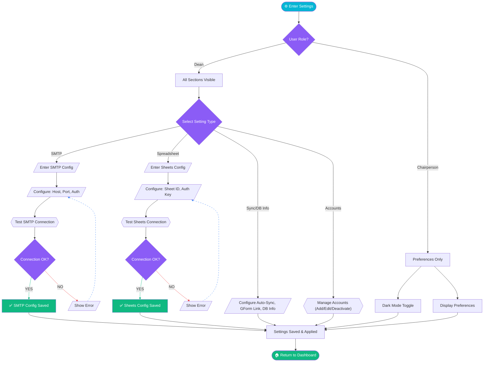
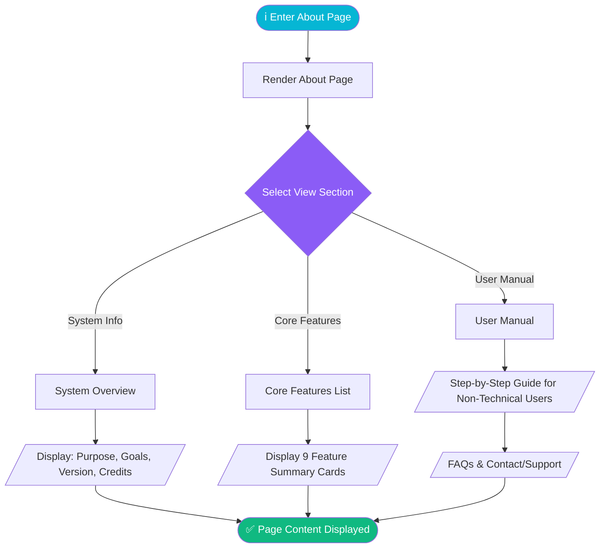

# Alumni DB — System Flowcharts

> **Version:** v2.0.0
> **Interactive HTML:** [alumni-db-flowcharts-v2-5.html](alumni-db-flowcharts-v2-5.html) — open in a browser for navigable, color-coded SVG diagrams.
> **Description:** Modular flowcharts covering all 10 system flows of the Alumni DB Management System, aligned with role-based access for Dean and Program Chairpersons.

---

## Legend

| Shape | Meaning |
|-------|---------|
| Rounded rectangle / Stadium | Start / End (Terminal) |
| Rectangle | Process |
| Diamond / Rhombus | Decision |
| Parallelogram | Input / Output |
| Hexagon | Sub-process / Action |
| Green arrow | YES path |
| Red arrow | NO / Error path |
| Blue dashed arrow | Return / loop-back |

---

## 1. System Overview

**Purpose:** High-level map of the complete application lifecycle — from launch through login, role-based access, 8 system modules, and exit.

### Flow Description

1. User launches the application.
2. The system displays the **Login Screen**.
3. User enters credentials (username & password).
4. **Valid Login?**
   - **NO** → Show error message ("Invalid credentials"). Loop back to enter credentials.
   - **YES** → Proceed to role identification.
5. **Identify User Role?** — Based on the `role` field from the accounts data:
   - **Dean** → Access all programs (CE · CpE · EE), full data scope.
   - **Chairperson** → Access own program data only (CE, CpE, or EE).
6. Both paths merge → Load the **Dashboard (Filtered View)** according to role scope.
7. **Select Module** — User navigates to one of 8 modules.
8. After completing work in any module, the user returns to the Dashboard.
9. **Exit App?**
   - **NO** → Loop back to module selection.
   - **YES** → Application Closed (terminal state).

### Additional Details

- **Login Gate:** The v1 "settings gate" is replaced by a login screen. Settings are no longer the entry point — authentication is.
- **Hub-and-Spoke Architecture:** The Dashboard remains the central hub. Every module returns to it.
- **Role-Based Data Scoping:** The role determined at login persists for the entire session and filters all data globally.

---

## 2. Login & Role-Based Access

**Purpose:** Full authentication flow — credential input, validation against accounts stored in the Google Sheets "Accounts" tab (with encrypted offline fallback), attempt lockout, role detection, and session start.

### Accounts Sheet Structure

Accounts are stored in a dedicated **"Accounts" tab** within the same Google Sheets spreadsheet:

| Column | Description |
|--------|-------------|
| `username` | Login username (unique) |
| `password` | Hashed password |
| `role` | `dean`, `ce_chair`, `cpe_chair`, or `ee_chair` |
| `full_name` | Display name |
| `is_active` | `TRUE` / `FALSE` — only active accounts can log in |
| `created_at` | ISO 8601 timestamp |
| `last_login` | ISO 8601 timestamp (updated on successful login) |

### Offline Fallback

- On the **first successful online login**, the system encrypts and caches the user's account record locally.
- If the internet is unavailable, the system authenticates against this local encrypted cache.
- Cache is refreshed on every successful online login.

### Additional Details

- **No Self-Registration:** First account is manually added to the Sheets tab.
- **Lockout Policy:** 3 consecutive failures → 5-minute lockout.
- **Session:** Stored in Zustand `auth.store`, ends on app close.

---

## 3. Analytic Dashboard

**Purpose:** Role-filtered data loading, summary stat cards, percentage metrics, and frequency/weighted mean tables.

### Additional Details

- **Role-Based Filter Applied First:** A Chairperson sees only their own program's statistics.
- **Stat Cards (KPIs):** Total Responses, per-program counts, % Board Passers, % Employed, % Field-Related, % Supervisory.
- **Survey Tables:** Frequency distribution and weighted mean (for Likert-scale data).

---

## 4. Alumni Directory

**Purpose:** Full CRUD operations with search/filter, GForm-based add, edit, delete, profile view — all role-filtered.

### Additional Details

- **GForm Integration:** The "Add" action links to the configured Google Form.
- **Validation Loop:** Both Add and Edit have validation loops.
- **Pending Sync:** All created/edited records are marked `sync_status = 'pending'`.
- **Delete Safety:** Requires explicit confirmation dialog.

---

## 5. Alumni Profiling

**Purpose:** Individual alumni profile view — complete response history, latest update highlights, and chronological timeline.

### Additional Details

- **History Snapshots:** Every edit creates a JSON snapshot in `alumni_history`.
- **Diff Highlighting:** Latest Updates view shows visual old → new diff indicators.
- **Timeline Navigation:** Click any timeline entry to expand full snapshot.

---

## 6. Reports & Export

**Purpose:** Export alumni data as PDF, DOCX, XLSX; filtered print; and print preview — all role-filtered.

### Additional Details

- **Role-Based Filter Applied First:** Chairpersons can only export their own program's data.
- **Excel Multi-Tab:** Data sheet, Filters Applied tab, Summary Statistics tab.
- **Print Preview:** `@media print` optimized view.

---

## 7. Data Synchronization

**Purpose:** Internet check, unsaved change notification, 4 sync modes, pending changes, conflict resolution.

### Additional Details

- **Internet Gate:** Sync is impossible without internet.
- **Unsaved Changes Notification:** Alerts user before syncing if local edits exist.
- **Auto-Sync Timer:** Configurable interval. Pauses on conflicts.
- **Conflict Resolution:** Manual — keep local, keep remote, or merge.

---

## 8. Sending Emails

**Purpose:** Role-filtered recipients, GForm link decision, compose, send via SMTP, history tracking.

### Additional Details

- **Role-Based Recipients:** CE Chairperson can only email CE alumni.
- **GForm Link Decision:** Optional inclusion for survey reminders.
- **Template Variables:** `{{fullName}}`, `{{program}}`, `{{yearGraduated}}`, etc.
- **Email History:** Every batch send logged with delivery status.

---

## 9. Settings

**Purpose:** SMTP + Sheets configuration with test/retry loops, Dean-only management sections, and user preferences.

### Settings Sections by Role Access

| Section | Dean | Chairperson |
|---------|------|-------------|
| SMTP Configuration | ✅ Manage | ❌ View-only |
| Spreadsheet Connection | ✅ Manage | ❌ View-only |
| Sync & Database Info | ✅ Manage | ❌ View-only |
| Accounts Management | ✅ Manage | ❌ Hidden |
| User Preferences | ✅ Manage | ✅ Manage |

---

## 10. About

**Purpose:** System overview, core feature summaries, and a user-friendly manual for non-technical users.

### 9 Core Features Listed

1. Login & Accounts
2. Analytics Dashboard
3. Alumni Directory
4. Alumni Profiling
5. Reports & Export
6. Data Sync
7. Sending Emails
8. Settings
9. About

### User Manual Design

- **Simple language** — no technical jargon
- **Large numbered steps** — clear action → result format
- **Visual aids** — screenshots/illustrations where applicable
- **FAQs** — common questions with reassuring answers

---

## Architecture Summary

| Module | Key Characteristics |
|--------|-------------------|
| **System Overview** | Login gate → role detection → hub-and-spoke with 8 modules |
| **Login & Access** | Sheets-based auth, encrypted offline fallback, 3-attempt lockout, 4 roles |
| **Analytic Dashboard** | Role-filtered stats, summary cards, % KPIs, freq/WM survey tables |
| **Alumni Directory** | 5 actions (Search, Add via GForm, Edit, Delete, View Profile), auto-sync queue |
| **Alumni Profiling** | 3 display views (History, Latest, Timeline), snapshot-based history |
| **Reports & Export** | 5 output types (PDF, DOCX, XLSX, Filtered Print, Preview/Print), role filtering |
| **Data Sync** | 4 sync modes (Pull, Push, Full, Auto-Sync), conflict resolution, unsaved change alerts |
| **Sending Emails** | Compose + History/Inbox branches, role-filtered recipients, GForm link option |
| **Settings** | SMTP + Sheets config, Dean-only management, preferences for all, dark mode |
| **About** | 3-section view (System Info, Core Features, User Manual), non-technical manual |
