# Alumni DB — Detailed ERD (Per-Entity)

> **Scope:** Column-level ERD for every entity in the system, organized by section.
> **Companion doc:** [erd-overview.md](erd-overview.md) — system-wide overview ERD.
> **Source of truth:** [`electron/database/schema.ts`](../../electron/database/schema.ts).

> **Notation:**
> - `PK` = primary key, `FK` = foreign key, `UK` = logical unique key (not always enforced)
> - `NN` = NOT NULL, `D` = has DEFAULT
> - Bracketed text after type = constraint or note
> - Mermaid `erDiagram` does not render CHECK constraints — listed in tables below each diagram

---

## Table of Contents

1. [`alumni`](#1-alumni-main-respondent-record) — main respondent record
2. [`alumni_history`](#2-alumni_history--versioned-snapshots) — versioned snapshots
3. [`email_history`](#3-email_history--bulk-send-log) — bulk send log
4. [`settings`](#4-settings--keyvalue-config) — key/value config
5. [`meta`](#5-meta--migration-tracking) — migration tracking
6. [Google Sheets `Accounts` tab](#6-external-google-sheets-accounts-tab) — external auth source
7. [Google Sheets program tabs](#7-external-google-sheets-program-tabs-ce--cpe--ee) — CE / CpE / EE
8. [`auth-cache.enc`](#8-external-auth-cacheenc--offline-auth-fallback) — offline auth fallback

---

## 1. `alumni` — Main Respondent Record

The widest table in the system: ~58 columns across 6 questionnaire sections + 5 system columns. Every record represents one survey response from one graduate (year ≥ 2018) of one program.

### 1.1 ERD — Section II: Respondent Information

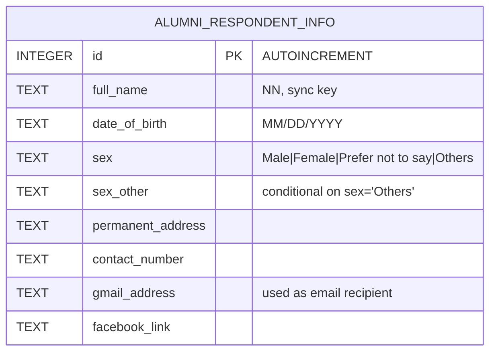

### 1.2 ERD — Section III: Academic Profile

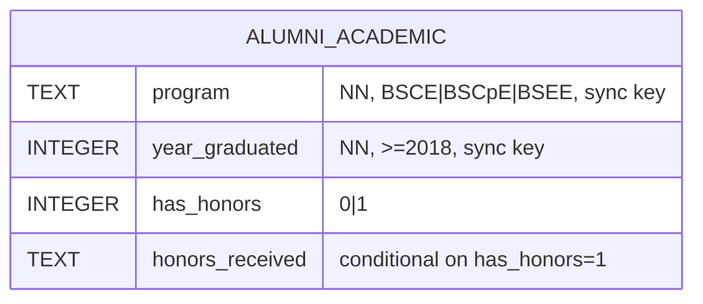

### 1.3 ERD — Section IV: Curriculum & Competencies

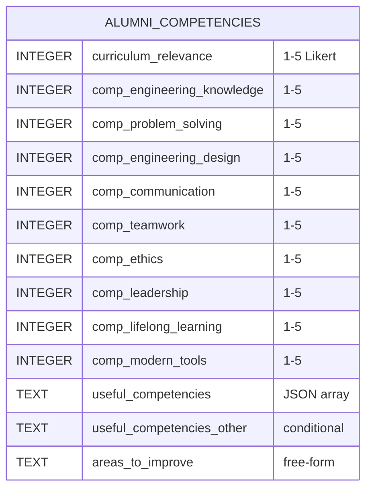

### 1.4 ERD — Section V: Licensure & Graduate School

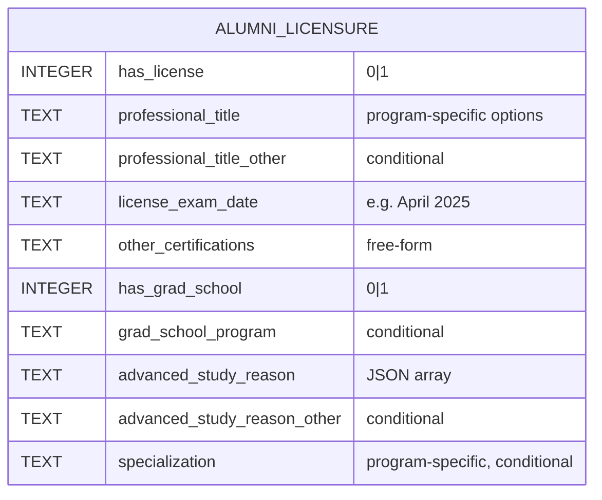

### 1.5 ERD — Section VI: Employment Data

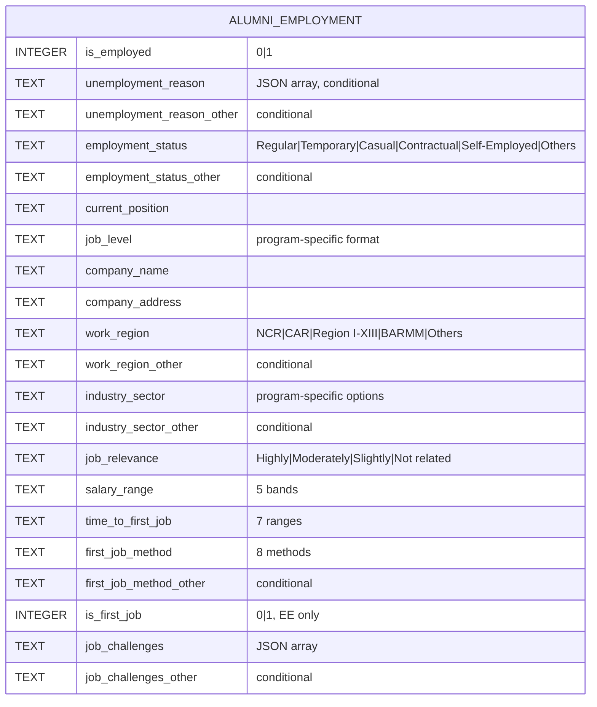

### 1.6 ERD — Section VII: Career Progression + System Columns

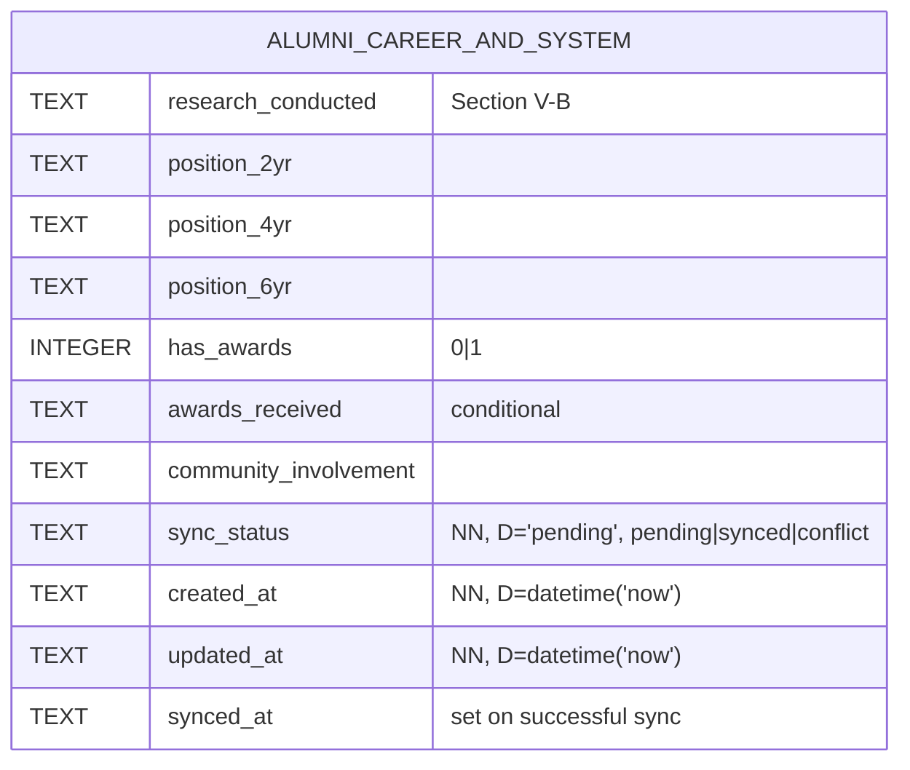

### 1.7 Constraints & Application-Level Rules

| Rule | Layer | Enforcement |
|------|-------|-------------|
| `id` is auto-increment surrogate | SQL | `INTEGER PRIMARY KEY AUTOINCREMENT` |
| `full_name` required | SQL + Zod | `NOT NULL` + Zod `.min(1)` |
| `program ∈ {BSCE, BSCpE, BSEE}` | Zod / Service | Stored as free `TEXT` for sync flexibility |
| `year_graduated >= 2018` | Zod / Service | Tracer-study window |
| Composite sync key | Service | `full_name` + `program` + `year_graduated` (uniqueness logical, not enforced by SQL) |
| Likert columns are 1–5 | Zod | DB allows NULL for unanswered items |
| `sync_status` defaults to `pending` on every insert and on every local UPDATE | Repository | Set to `synced` only by sync engine |
| `updated_at` refreshed on every UPDATE | Repository | Application sets value; not a SQL trigger |
| Snapshot inserted into `alumni_history` BEFORE applying UPDATE | Repository | See [§2](#2-alumni_history--versioned-snapshots) |

> Total columns including system metadata: see [data-dictionary.md](data-dictionary.md#complete-column-count-summary).

---

## 2. `alumni_history` — Versioned Snapshots

Append-only audit table. Every UPDATE on `alumni` inserts the *prior* state here before the change is applied — used to drive the Profiling page Timeline tab.

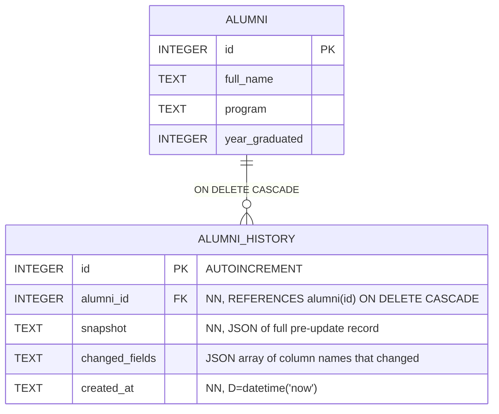

### 2.1 Rules

| Rule | Detail |
|------|--------|
| **Insertion path** | Repository writes a snapshot inside the same transaction as the UPDATE. |
| **No SQL trigger** | Snapshot logic lives in `alumni-history.repository.ts` to keep `changed_fields` accurate. |
| **Cascade behavior** | Deleting an alumni record cascades to all their history rows. (Hard deletes are rare — typically only Dean role.) |
| **Index** | `idx_history_alumni (alumni_id)` for timeline lookups. |
| **Format of `snapshot`** | JSON string mirroring the `alumni` row at the time of UPDATE — not a structured table, to insulate history from schema evolution. |
| **Format of `changed_fields`** | JSON array of column names, e.g. `["current_position","salary_range"]`. |

---

## 3. `email_history` — Bulk Send Log

Standalone table — no SQL FK to `alumni`. Recipients are stored as a JSON array of `gmail_address` strings (the logical link).

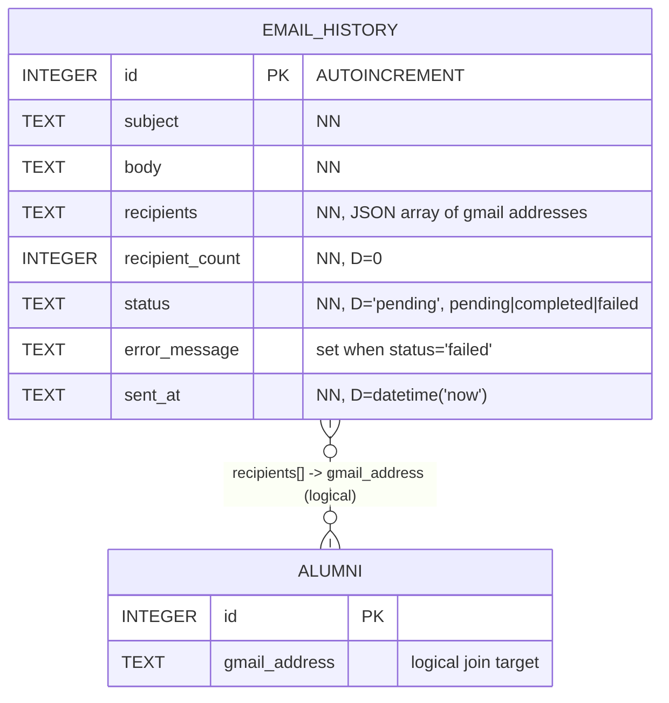

### 3.1 Rules

| Rule | Detail |
|------|--------|
| **Why no FK?** | An email batch may target alumni who have since been deleted; we want the history to survive. JSON array preserves intent without breaking on deletes. |
| **Status transitions** | `pending → completed` on full success, `pending → failed` on SMTP error. Partial failures: status `failed` with `error_message` describing per-recipient failures. |
| **`recipient_count` denormalization** | Cached count avoids JSON parsing for list views. |
| **Index** | `idx_email_status (status)` for filtering on the History page. |

---

## 4. `settings` — Key/Value Config

Flat key/value store. Encryption is per-key, not per-row.

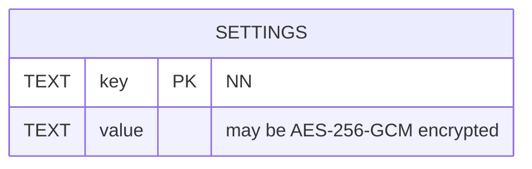

### 4.1 Known Keys

| Key | Encrypted? | Default | Purpose |
|-----|-----------|---------|---------|
| `institution_name` | No | `"SLSU College of Engineering"` | Header on reports |
| `smtp_host` | No | unset | Outbound SMTP server |
| `smtp_port` | No | `587` | SMTP port |
| `smtp_user` | No | unset | SMTP username |
| `smtp_pass` | **Yes** | unset | SMTP password (AES-256-GCM) |
| `smtp_tls` | No | `true` | TLS on/off |
| `sheets_id` | No | seeded from constants | Google Sheets workbook ID |
| `sheets_key` | **Yes** | seeded encrypted | Service account JSON (AES-256-GCM) |
| `sheets_tab_ce` | No | `"CE"` | Tab name for Civil Engineering |
| `sheets_tab_cpe` | No | `"CpE"` | Tab name for Computer Engineering |
| `sheets_tab_ee` | No | `"EE"` | Tab name for Electrical Engineering |
| `gform_link` | No | unset | URL printed on outreach emails |
| `auto_sync_enabled` | No | `false` | Toggle for periodic sync |
| `auto_sync_interval` | No | unset | Minutes between auto-syncs |
| `dark_mode` | No | unset | UI preference |

### 4.2 Rules

| Rule | Detail |
|------|--------|
| **Defaults seeded once** | `INSERT OR IGNORE` on startup via `insertDefaults()` in `schema.ts`. |
| **Encryption boundary** | Encryption happens in the repository before writing, decryption on read — never on the SQL side. |
| **All callers go through `settings.repository.ts`** | No service or IPC handler reads `settings` directly via `getDb().exec(...)`. |

---

## 5. `meta` — Migration Tracking

Reserved key/value table used by `runMigrations()` to determine which schema migrations to apply.

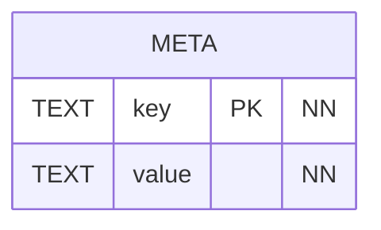

### 5.1 Known Keys

| Key | Value | Purpose |
|-----|-------|---------|
| `schema_version` | Integer as string (currently `"4"`) | Compared against highest migration in `electron/database/migrations/` |

### 5.2 Rules

| Rule | Detail |
|------|--------|
| **Upgrade path** | When a new migration is added, bump `schema_version` inside the migration's `up()` function. |
| **Downgrade** | Not supported — migrations are forward-only. |
| **Boot sequence** | `createTables()` → `insertDefaults()` (seeds `schema_version`) → `runMigrations()` (advances it) → `safeSave()`. |

---

## 6. External: Google Sheets `Accounts` Tab

Authoritative source for user accounts. **Not a local SQL table** — managed by the Dean directly in the spreadsheet.

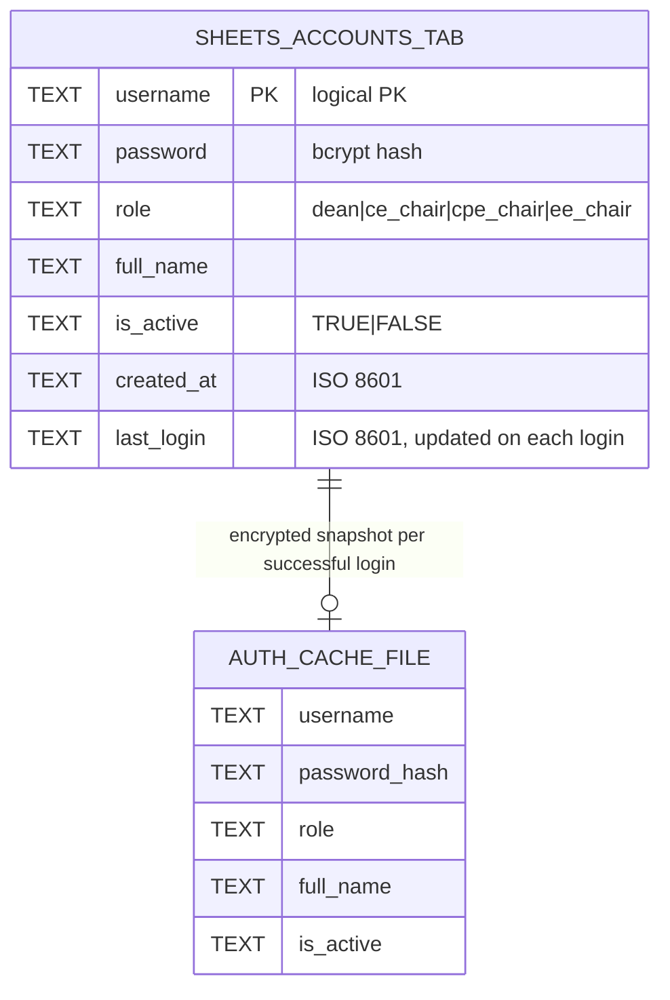

### 6.1 Rules

| Rule | Detail |
|------|--------|
| **Why Sheets?** | Centralized management; first account seeded manually (no self-registration). |
| **Hashing** | `bcryptjs` salt rounds = 10. Never stored in plaintext. |
| **Lockout** | 3 failed logins → 5-minute client-side lockout (state lives in renderer auth store, not in Sheets). |
| **Role → program mapping** | `dean` ⇒ `[BSCE, BSCpE, BSEE]`, `ce_chair` ⇒ `[BSCE]`, `cpe_chair` ⇒ `[BSCpE]`, `ee_chair` ⇒ `[BSEE]`. Used for `WHERE program IN (?)` scoping. |
| **`last_login` write** | Sheets API write on each successful online login. |

---

## 7. External: Google Sheets Program Tabs (CE / CpE / EE)

Three tabs (one per program) mirror the `alumni` table's questionnaire columns. Synced bidirectionally with the local DB.

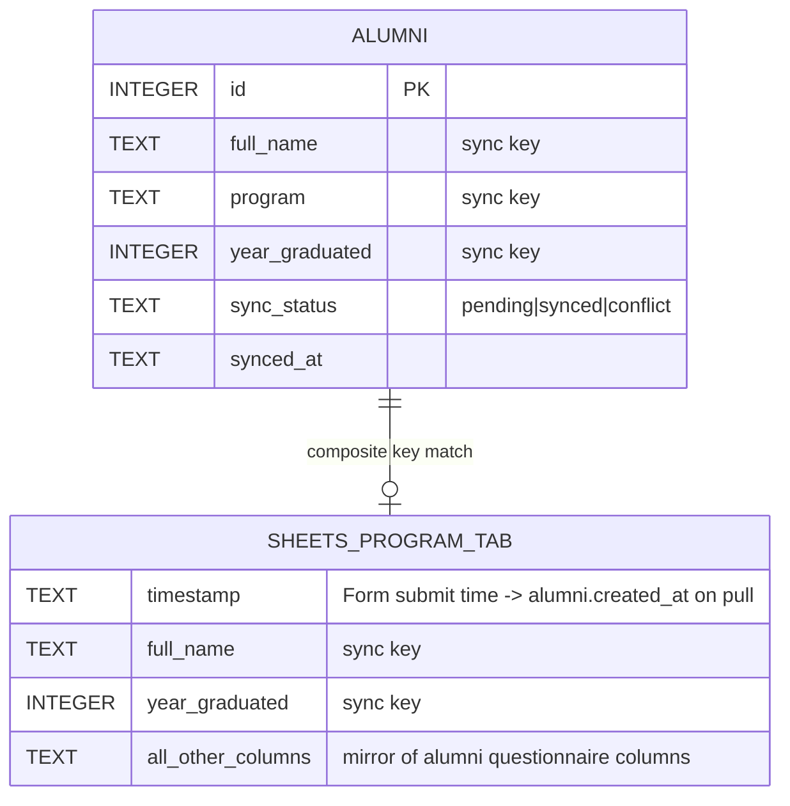

### 7.1 Sync Rules

| Rule | Detail |
|------|--------|
| **Composite match key** | `full_name` + `program` (implicit per tab) + `year_graduated`. |
| **Pull** | Sheets → DB. New rows: `sync_status='synced'`, `created_at=Timestamp`, `synced_at=now()`. Existing rows updated only if Sheets row is newer. |
| **Push** | DB → Sheets. Only rows where `sync_status='pending'`. On success: `sync_status='synced'`, `synced_at=now()`. |
| **Conflict** | If both sides changed since last sync, mark local row `sync_status='conflict'` and surface in the Sync UI for manual resolution. |
| **Tab routing** | `program` column on the alumni record determines which tab is targeted (`sheets_tab_ce` / `sheets_tab_cpe` / `sheets_tab_ee` from `settings`). |

---

## 8. External: `auth-cache.enc` — Offline Auth Fallback

A single file at `{userData}/auth-cache.enc` holding an AES-256-GCM-encrypted JSON array of `CachedAccount` objects.

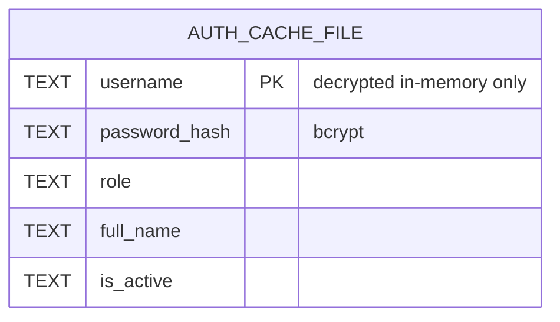

### 8.1 Rules

| Rule | Detail |
|------|--------|
| **Refresh trigger** | Every successful **online** login overwrites the file with the latest `Accounts` tab contents. |
| **First-run requirement** | The very first login must be online — no cache exists yet. |
| **Decryption** | Loaded into memory only when the network is unavailable; never persisted decrypted. |
| **Eviction** | Manual — user can wipe via Settings → "Clear offline cache". |

---

## 9. Quick-Reference: Where Each Field Lives

| Domain | Local SQL | Google Sheets | Encrypted File |
|--------|-----------|---------------|----------------|
| Alumni questionnaire data | `alumni`, `alumni_history` | `CE`, `CpE`, `EE` tabs | — |
| User accounts | — | `Accounts` tab | `auth-cache.enc` (mirror) |
| Email send log | `email_history` | — | — |
| App configuration | `settings` (some keys encrypted) | — | — |
| Schema version | `meta` | — | — |

---

## 10. Companion Reading

- **[erd-overview.md](erd-overview.md)** — high-level system ERD with all tiers.
- **[database.md](database.md)** — full DDL, crash protection, key SQL queries.
- **[data-dictionary.md](data-dictionary.md)** — questionnaire-by-questionnaire field map (~58 columns).
- **[architecture.md](architecture.md)** — repository / service / IPC layering.
