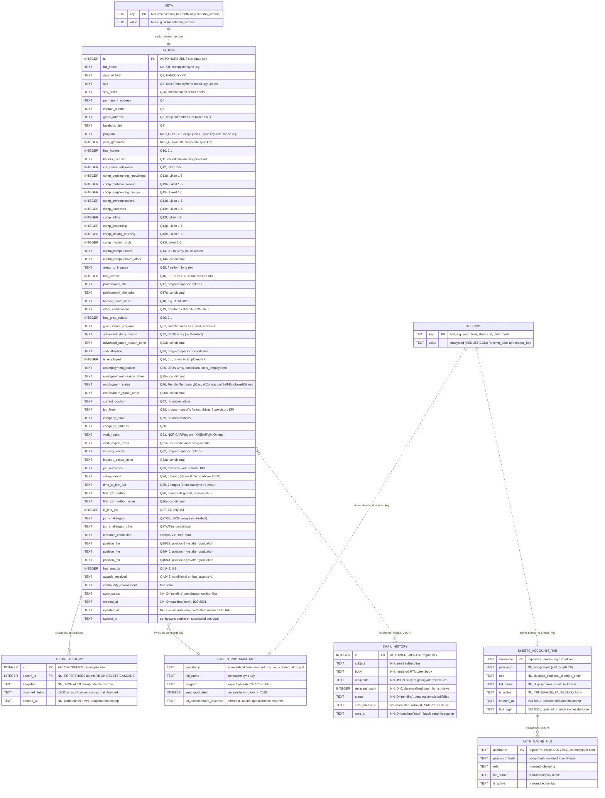
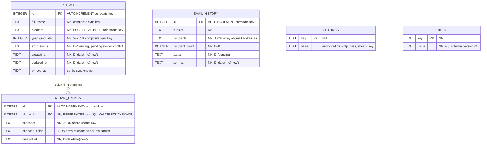

# Alumni DB — ERD Overview

> **Scope:** End-to-end Entity-Relationship Diagram of the Alumni DB Management System.
> **Engine:** sql.js (SQLite WASM) — single `alumni.db` file.
> **Companion doc:** [erd-detailed.md](erd-detailed.md) — per-entity column-level ERDs.
> **Source of truth:** [`electron/database/schema.ts`](../../electron/database/schema.ts), [`database.md`](database.md), [`data-dictionary.md`](data-dictionary.md).

---

## 1. System Data Landscape

The system spans **three storage tiers**, only one of which is a relational database:

| Tier | Store | Contents | Owner |
|------|-------|----------|-------|
| **Local SQL** | `alumni.db` (sql.js) | 5 tables: `alumni`, `alumni_history`, `email_history`, `settings`, `meta` | Electron main process |
| **Remote Sheets** | Google Sheets workbook | 4 tabs: `CE`, `CpE`, `EE`, `Accounts` | Google API v4 |
| **Encrypted Cache** | `{userData}/auth-cache.enc` | AES-256-GCM blob of `Accounts` snapshot | Offline auth fallback |

The ERD below covers **all three tiers** so the relationships across them are explicit.

---

## 2. High-Level ERD (All Entities)

---

## 3. Local DB Only (Simplified)

For day-to-day work inside the SQL layer, ignore the external entities:

> Only `alumni → alumni_history` has a hard FK. All other tables are independent — `email_history`, `settings`, and `meta` are standalone.

---

## 4. Relationship Catalog

| # | From | To | Type | Enforcement | Purpose |
|---|------|----|------|-------------|---------|
| R1 | `alumni.id` | `alumni_history.alumni_id` | 1 : N | **Hard FK** (`ON DELETE CASCADE`) | Versioned audit trail; populated by repository on every UPDATE |
| R2 | `alumni` (composite key) | `SHEETS_PROGRAM_TAB` row | 1 : 1 | **Logical** (sync engine) | Match key = `full_name` + `program` + `year_graduated` |
| R3 | `alumni.gmail_address` | `email_history.recipients[]` | N : M | **Logical** (JSON array) | Recipient resolution at send time; not an FK |
| R4 | `SHEETS_ACCOUNTS_TAB` | `auth-cache.enc` | 1 : 1 | **Logical** (refreshed on login) | Offline auth fallback |
| R5 | `settings` | Sheets / SMTP integrations | 1 : 1 | **Logical** | Stores `sheets_id`, `sheets_key` (enc), `smtp_*` (enc) |
| R6 | `meta.schema_version` | Migration runner | 1 : 1 | **Logical** | Drives `runMigrations()` on startup |

> **Why so few hard FKs?** sql.js supports FKs (we enable `PRAGMA foreign_keys = ON`), but most cross-table links are JSON arrays or external stores. Only the alumni → history relationship is a true relational link.

---

## 5. Entity Cardinality Summary

| Entity | Expected Volume | Growth Driver |
|--------|----------------|---------------|
| `alumni` | < 50,000 rows | One row per survey respondent (graduation year ≥ 2018) |
| `alumni_history` | ~5–10× alumni rows | Every UPDATE writes a snapshot |
| `email_history` | < 5,000 rows | One row per send batch |
| `settings` | ~15 rows | Fixed key set (smtp_*, sheets_*, ui prefs) |
| `meta` | 1–5 rows | `schema_version` + reserved keys |
| `SHEETS_PROGRAM_TAB` (×3) | Mirrors `alumni` | Form-driven |
| `SHEETS_ACCOUNTS_TAB` | 4–10 rows | One per faculty user (Dean + 3 chairs) |
| `auth-cache.enc` | Mirrors Accounts tab | Refreshed on each successful online login |

---

## 6. Cross-Cutting Constraints

| Constraint | Where Enforced | Notes |
|-----------|----------------|-------|
| `program ∈ {BSCE, BSCpE, BSEE}` | Zod schema + repository | Not a CHECK constraint — kept as `TEXT` for sync flexibility |
| `year_graduated >= 2018` | Zod schema + service layer | 5-year post-graduation tracer window |
| `sync_status ∈ {pending, synced, conflict}` | Repository defaults to `pending` on insert/update | |
| Role-based scoping | All `alumni*` queries use `WHERE program IN (?)` from `auth.store.accessiblePrograms` | Dean = all 3, Chairs = 1 |
| Atomic writes | `db-manager.safeSave()` (`.tmp` → `.bak` → `.db`) | Never `fs.writeFileSync` directly on `alumni.db` |
| Encryption at rest | `electron/utils/crypto.ts` (AES-256-GCM) | `smtp_pass`, `sheets_key`, `auth-cache.enc` |

---

## 7. Indexes

Defined in [`schema.ts`](../../electron/database/schema.ts):

| Index | Table | Column(s) | Query It Serves |
|-------|-------|-----------|-----------------|
| `idx_alumni_program` | `alumni` | `program` | Role-based scoping (every dashboard / directory query) |
| `idx_alumni_year` | `alumni` | `year_graduated` | Year filters in reports |
| `idx_alumni_sync` | `alumni` | `sync_status` | Pending push detection on Sync page |
| `idx_alumni_name` | `alumni` | `full_name` | Global search & sync composite-key match |
| `idx_history_alumni` | `alumni_history` | `alumni_id` | Profiling timeline lookup |
| `idx_email_status` | `email_history` | `status` | Email history filter |

---

## 8. Read This Next

- **[erd-detailed.md](erd-detailed.md)** — Per-entity ERD with every column, type, default, nullability, and dictionary cross-reference.
- **[database.md](database.md)** — Full schema source, crash-safety design, key SQL patterns.
- **[data-dictionary.md](data-dictionary.md)** — Questionnaire → DB column mapping (~58 columns).
